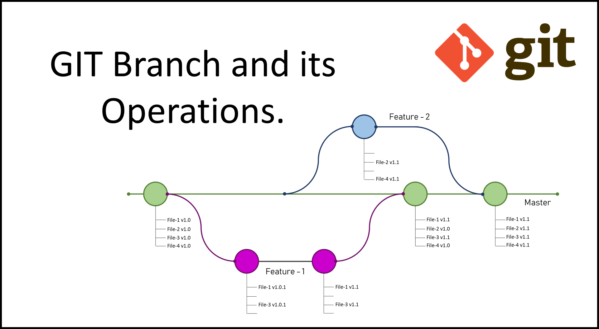

# Liebe Workshop Teilnehmer:innen,

für unseren Workshop am 02. Dezember mit dem Thema „Git“ bitten wir euch Git schon zu installieren und folgenden Link während des Workshops bereitzuhaben: https://github.com/xhypeDE/git-workshop.git

Die meisten von euch sollten Git schon haben. Wie genau ihr aber prüft, ob Git installiert ist und wie ihr Git installiert, falls ihr Git noch nicht installiert habt, erklären wir hier:

## Windows:
- Über die Tastenkombination Win+R öffnet sich ein Fenster, in dem ihr das Programm „Eingabeaufforderung“ starten könnt
- Anschließend gebt ihr `cmd.exe` ein und bestätigt das mit Enter
- Es öffnet sich jetzt das Fenster für die Eingabeaufforderung
- Um jetzt zu prüfen, ob Git installiert ist, kann man einfach eingeben `git --version`.
- Falls hier jetzt eine Rückmeldung wie `git version 2.33.0.windows.2` oder ähnlich, angezeigt wird, ist Git schon installiert und man braucht hier nichts Weiteres vorzunehmen.
- Falls jedoch der Befehl nicht gefunden wird, muss Git noch installiert werden
- Über folgenden Link kann der Git Installer für Windows heruntergeladen werden: https://git-scm.com/download/win hier den „Standalone Installer“ herunterladen und ausführen
- Nach Abschluss der Installation kann man wieder durch das Eingeben von `git --version` in der Eingabeaufforderung prüfen, ob Git erfolgreich installiert wurde.

## Mac:
- Im Applikationsordner muss das Programm „Terminal“ ausgeführt werden.
- Beim Ausführen öffnet sich eine Eingabeaufforderung, hier kann man jetzt durch die Eingabe des Befehls `git --version` prüfen, ob Git schon installiert ist.
- Falls hier die Rückmeldung ausgibt `git version 2.33.0` oder ähnliches ist Git schon installiert und es muss nicht weiteres vorgenommen werden
- Falls jedoch der Befehl nicht gefunden wird, ist Git noch nicht installiert
- Um Git beziehen zu können, muss erst Homebrew installiert werden. Dieses Programm ermöglicht die Installation von anderen Tools und Programmen über das Terminal
- Hierfür muss folgender Befehl ausgeführt werden:
     `/bin/bash -c "$(curl -fsSL https://raw.githubusercontent.com/Homebrew/install/HEAD/install.sh)"`

- Nach der Installation von Homebrew kann man durch Ausführen des Befehls:
`brew install git` Git installieren.
- Nach Abschluss der Installation kann man wieder durch das Eingeben von `git --version` im Terminal prüfen, ob Git erfolgreich installiert wurde.

Bei Problemen könnt ihr uns gerne über E-Mail oder Webex kontaktieren.

Mit freundlichen Grüßen
Christian Tolu & Marwand Ayubi

---

# Workshop Phase 1

## Getting started
1. Projektlink kopieren
2. Eingeabeaufforderung / Terminal oder eine andere bevorzugte Terminalanwendung öffnen

## Basic Commands
Um im Terminal zurecht zukommen sollten wir die Grundlegenden Commands kennen und verstehen. Diese werden hier aufgeführt und können während des Workshops als Cheat Sheet genutzt werden.

#### Windows

## Cloning

Das klonen von bestehenden Projekten ist einer der grundlegenden Commands bei Git. Beim Klonen wird eine Kopie des Verzeichnisses heruntergeladen und lokal zur Bearbeitung gespeichert. Hierbei wird gleichzeitig das Verzeichnis des Projekts lokal als Git Repository initialisiert um weitere Git-Operationen zu ermöglichen.

Das Klonen kann bei GitLab über zwei verschiedene Protokolle durchgeführt werden. Grundsätzlich sind das HTTPS und SSH.

SSH:
Hierfür muss ein SSH-Schlüssel generiert werden und im GitLab hinterlegt werden. Der Vorteil hierbei ist: nach anlegen des SSH-Keys wird dieser zur authentifizierung genutzt und man muss sein Passwort nicht jedesmal erneut eingeben.

HTTPS:
Die eher verbreitetere Methode zum Klonen ist das nutzen des HTTPS Protokolls. Hier wird der Nutzer über Benutzername und Passwort authentifiziert.

Zur einfachheit nutzen wir das HTTPS Protokoll.

Zunächst müssen wir auf unserem PC in das gewünschte Verzeichnis navigieren indem wir das Projekt kopieren wollen.

Wenn wir hier im richtigen Verzeichnis sind können wir anschließend das Projekt mit dem Command:
`git clone 'URL des Repositorys'`
klonen. 

> #### Achtung!
> Da aufgrund des Hackerangriffs des Zertifikat von GitLab abgelaufen ist und nicht erneuert werden kann müssen wir den Command abändern. Beim Klonen wird nämlich aufgrund des HTTPS Protokolls das Zertifikat auf Gültigkeit überprüft. In diesem Fall wissen wir, dass das Zertifikat abgelaufen ist. Dieser Kommand sollte aus Sicherheitsgründen im Normalfall nie genutzt werden.

`git clone git -c http.sslVerify=false https://gitlab.win.hs-heilbronn.de/mayubi/fsew-git-workshop.git`

> #### Erklärung:
> * Der Befehl git sagt der Eingabeaufforderung das git verwendet werden soll.
> * Der Befehl clone gibt die Anweisung das ein Repository geklont werden soll. 
> * Mit dem sogenannten Flag "-c" wird die Konfiguration angepasst.
> * Nach dem Flag wird erwartet welche Konfiguration angepasst werden soll.
> * Wir möchten mit "http.sslVerify=false" die Prüfung des Zertifikats abschalten. 

Nach der Eingabe des Kommands wird eventuell euer Benutzername und Passwort für GitLab abgefragt. Anschließend wird das Projekt im aktuellen Verzeichnis heruntergeladen.

## Initializing
Das initialisieren eines Git Repositories wird dann wichtig, wenn wir einen bestehenden Ordner haben oder lokal ein leeres Git Repository aufsetzen wollen, den wir mit Git als Versionskontrollsystem tracken wollen.

Zunächst müssen wir auf unserem PC in das gewünschte Verzeichnis navigieren indem wir ein Projekt initialisieren wollen.

Dann nutzen wir folgenden Command:
`git init`

## Add - Commit - Push - Pull

Angenommen das geklonte Projekt wäre ein Softwareprodukt und wir möchten nun eine neue Datei teilen und dem gesamten Entwicklungsteam bereistellen.

Erstmal müssen wir hierfür eine neue Datei erstellen. Um es einfach zu halten erstellen wir eine simple Textdatei im Ordner des geklonten Projekts.

#### Windows
* vom Terminal aus mit dem Command `start .` das Fenster im Explorer öffnen
* mit Rechtsclick -> Neu -> Neues Textdokument die Textdatei erstellen
* in die Textdatei eine Nachricht reinschreiben und das Dokument mit eurem Namen.txt abspeichern

#### Mac
* vom Terminal aus mit dem Command `nano <euerName.txt>` die Textbearbeitung öffnen
* hier eine Nachricht schreiben
* die Datei mit dem Shortcut CTRL + O speichern und mit CTRL + X schließen

### Die Staging Area
Diese "Area" ist der Bereich in dem Änderungen die im nächsten Commit erfasst werden sollen gespeichert werden.

Durch den Command `git add <dateiname.txt>` wird eine Datei in dieser Staging Area erfasst.
> Tipp: Mit `git add --all` können alle (modifizierten, neuen und gelöschten) Dateien erfasst werden.

### Status
Mit dem Command `git status` lässt sich der aktuelle Status des Projektordners und der Veränderungen anzeigen.

### Commit
Wenn unsere Datei(en) in Staging erfasst ist können wir nun diese mit dem Command `git commit -m <Commit Nachricht>` in das lokale repository erfassen.

Nach der Bestätigung des Comands muss ein weiterer Command ausgeführt werden um die Änderungen auch auf dem remote repository zu erfassen (Gitlab).

### Push
Um unsere Änderungen jetzt auf den remote repository zu erfassen nutzen wir den Command `git push`

> Hinweis: Falls hier ein Fehler auftritt liegt das höchstwahrscheinlich daran, dass ein anderes Workshopmitglied schon ein commit gepushed hat und die Dateien auf dem lokalen repository nicht mehr die gleichen sind wie vor eurem versuchten push.

>### Pull
> Hierfür könnt ihr den Command `git pull` nutzen um die letzten Änderungen zu holen und danach wieder mit `git push` das repository pushen.

## Log
Um den Verlauf von Commits anzuschauen kann man den Command `git log`nutzen

## Diff
Ein weiterer nützlicher Command ist `git diff` hiermit kann man sich Änderungen anzeigen lassen, die noch nicht in die Staging Area hereingenommen wurden.

## Branches

Einer der wichtigsten Features von Git sind die sogenannten Branches.
Ein Branch represäntiert eine unabhängige Entwicklungslinie. Mit Branches kann die Entwicklung verschiedener Features abgetrennt vom "Main" Branch also dem Hauptbranch parallel durchgeführt werden und zu einem späteren Zeitpunkt mit einem **Merge** in den Main Branch integriert werden.

#### Branch Commands
`git branch` - Liste aller Branches und des aktuellen aktiven Branch

`git branch <branch>` - Erstellt einen neuen branch mit dem <branch>
> Hinweis: Es wird hier jedoch nicht in den neu erstellten Branch gewechselt.
> Um den Branch zu wechseln kann man den Command `git checkout <branchname>` nutzen.

`git branch -d <branchname>` - Löscht den Branch mit dem Namen "branchname"

`git branch -m <branchname>` - Nennt den aktuellen Branch um in "branchname"

Um Änderungen im aktuellen Branch auch auf dem remote-repo (GitLab) zu pushen muss folgender Command benutzt werden:
`git push --set-upstream origin <branchname>`

## Merging
Um einen Branch mit einem anderen Branch wieder zu vereinen wird der Command `git merge <branchname>` ausgeführt. Wichtig hierbei ist das <branchname> der Branch ist der in den aktuellen aktiven Branch gemerged wird. Falls also ein Branch in Main gemerged werden soll, wird zuerst mit `git checkout main` in den Main Branch gewechselt bevor der Command ausgeführt wird.

### Merge Konflikt

Beim Mergen kann es zu einem Merge-Konflikt vorkommen.
Dies passiert meistens, wenn eine Datei von zwei verschiedenen Entwicklern oder auf verschiedenen Branches verändert wurde und git nicht selber weiß wie dieser Konflikt zu lösen ist.
Der Konflikt muss manuell in der Datei gelöst werden.

Um euch zu zeigen wie man einen Konflikt im Terminal löst werden wir erstmal einen erstellen

- Als erstes wird über `git branch` überprüft ob wir in unserem Branch seid.
- Dann wird eine .txt-Datei erstellt die später gemerged werden soll
- Diese Datei wird dann in unseren Branch gepusht
- Als Nächstes erstellen wir einen neuen Branch mit "Name"+merge als Namen
- Jetzt schreiben wir etwas in diese Datei und pushen sie mit dem Befehl ` git push --set-upstream origin "'Name'merge"`
- Jetzt wechseln wir in den vorherigen Branch wieder zurück
- Hier wird nochmal in die Datei geschrieben und gepusht
- Jetzt werden die Branches mit `git merge "'Name'merge"` gemerged

Jetzt sollte es zu einer Fehlermeldung kommen. Der automatische merge ist fehlgeschlagen und ein Mergekonflikt ist vorhanden.
Wenn man den Befehl `git mergetool` eingibt kommt, kann man mit "Enter" vim starten um den Konflikt zu lösen. 

# Commits rückgängig machen
`git revert <commit>` - Erstellt ein Commit bei dem die Änderungen aus dem angegebenen Commit rückgängig gemacht werden.

`git checkout <commit>` - Macht Änderungen nach diesem Commit rückgängig

`git reset <mode> <commit>` - Löscht alle Commits bis zu dem angegebenen Commit.  

modes: soft, mixed, hard  
soft: Bringt alle Änderungen in den Staged-Bereich  
mixed: Alle Änderungen sind nicht im Staged-Bereich  
hard: Alle Änderungen werden gelöscht
